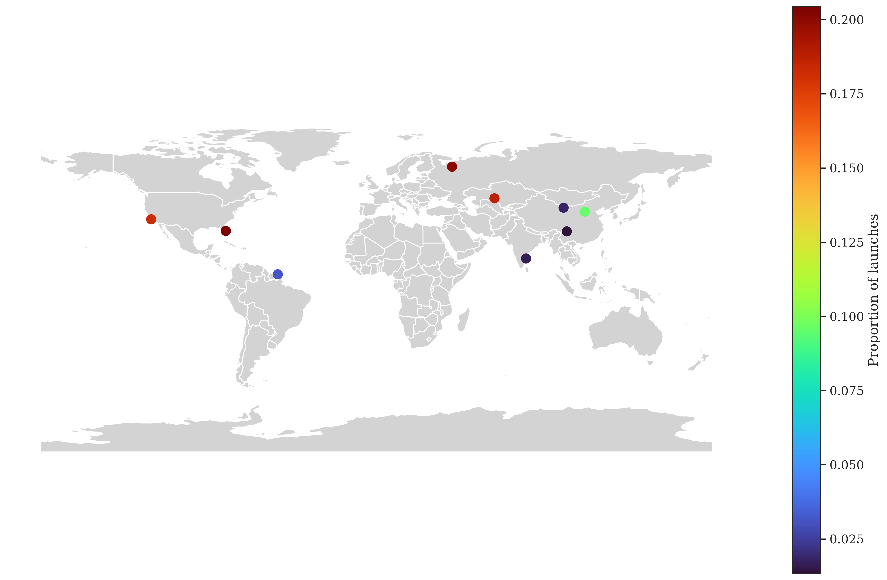
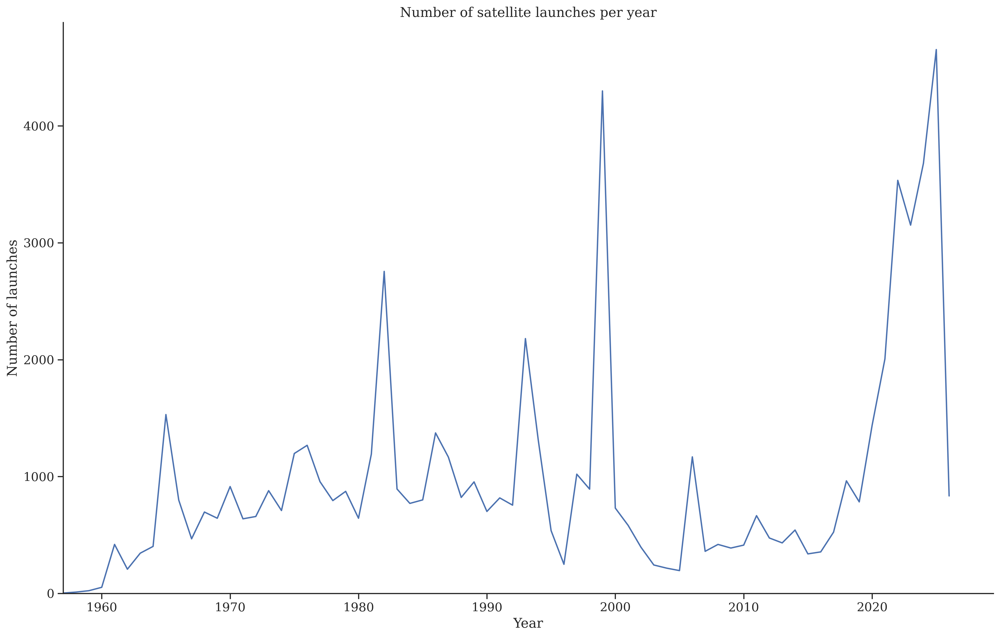
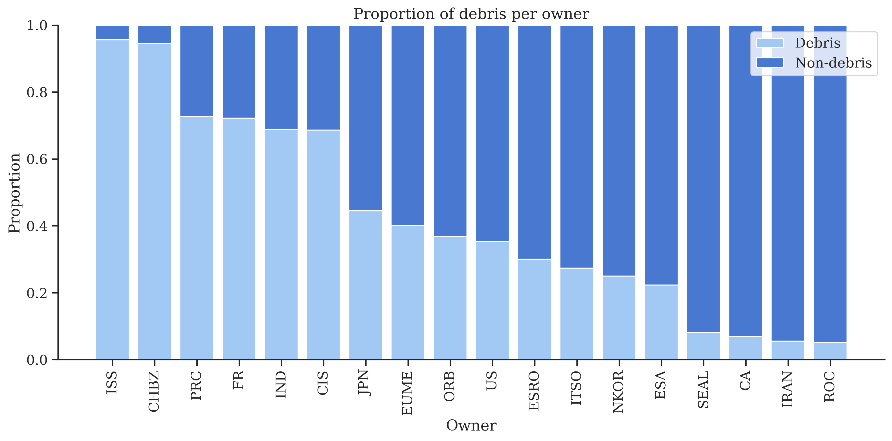
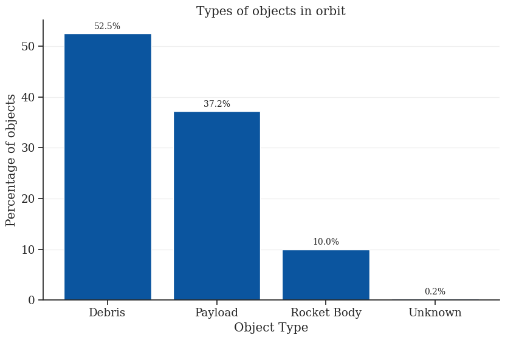

# Dataset

The main dataset used in this project comes from the Satellite Catalog (SATCAT) provided by [CelesTrak](https://celestrak.org/satcat/).

This catalog contains information about objects currently present in Earth orbit. The objects are categorized into several groups, including active satellites, inactive satellites, rocket bodies, and unidentified objects.
For every active satellites, the dataset includes orbital information in the form of Two-Line Element sets (TLEs), which allow the orbit of the object to be reconstructed. In addition and for all objects the dataset provides metadata such as:

- Operational status
- Decay rate
- Owner or operating country/organization
- Launch site
- Launch date
- apogee and perigee

These attributes make the dataset suitable for both orbital analysis and statistical exploration of space activity.


# Problematic

The goal of this project is to give a general audience interested in space traffic and satellite activity a better understanding of the number of objects currently orbiting Earth. While satellites are frequently mentioned in the media, it is often difficult for the public to visualize how many objects are actually present in space and how they are distributed.
One objective is therefore to provide a clear visual representation of how crowded different orbital regions are, such as:
- Low Earth Orbit (LEO)
- Medium Earth Orbit (MEO)
- Geostationary Orbit (GEO)

Another important aspect concerns the allocation of orbital space. In most orbital regions, access to orbit effectively follows a first-come, first-served principle (with stricter regulations mainly applying to GEO). Satellites cannot simply be placed anywhere; operators must avoid collision trajectories and respect orbital dynamics constraints.

As a result, launching satellites also implies occupying and managing orbital space. By visualizing the number of satellites owned or operated by different countries or organizations, it becomes possible to highlight which actors currently occupy the largest share of orbital resources. This can provide insight into the relative influence of different countries in space activities.


# Exploratory Data Analysis

You can use the python environment by running in the `env` directory:

```bash
cd this_repo/env_setup
conda env create -f environment.yml
```

Several exploratory analyses will be performed to better understand the dataset and identify relevant patterns:



The distribution of satellites per launch site highlights a strong concentration of activity in a limited number of locations. A few major spaceports dominate global launch activity. This uneven distribution suggests that access to space is still controlled by a small number of key players.



The number of satellites launched per year shows a clear increasing trend, with a significant acceleration in recent years. This growth is largely driven by the emergence of large satellite constellations and increased commercial activity in space. The trend illustrates the rapid intensification of space traffic and raises concerns about long-term sustainability and congestion in orbit.



The proportion of active satellites versus debris varies significantly between owners. Some actors maintain a high ratio of operational satellites, while others have accumulated a larger amount of inactive objects or debris. This disparity may reflect differences in mission lifecycle management, technological maturity, or historical legacy in space operations.



The majority of objects are concentrated in Low Earth Orbit (LEO), making it the most congested orbital region. This is expected due to its accessibility and suitability for communication and Earth observation missions. In contrast, MEO and GEO host fewer objects but remain strategically important due to their specific orbital characteristics. This distribution highlights the increasing pressure on LEO as the primary region for modern satellite deployment

These analyses will help reveal trends in space activity, such as the growth of satellite constellations or the accumulation of debris in certain orbital regimes.

# Related work

One example of related work: https://nattybumppo.github.io/rocket-launch-history/

This project presents the history of rocket launches over time, allowing users to explore launch activity through an interactive interface.


# Originality of the approach

Our approach focuses on highlighting the current distribution of orbital objects and the actors responsible for them.

In a geopolitical context, having satellites in orbit can provide strategic advantages. Satellites enable communication, navigation, Earth observation, and intelligence gathering... Additionally, occupying certain orbital positions can make it easier to deploy future satellites in the same regions.

By visualizing satellite ownership and orbital distribution, our project aims to highlight which countries or organizations are currently the dominant players in space and to what extent.


# Sources of inspiration

The project is also inspired by concepts discussed in the course Space Mission Design and Operations (EE-585), which covers topics such as orbital mechanics, satellite deployment, and space operations.
